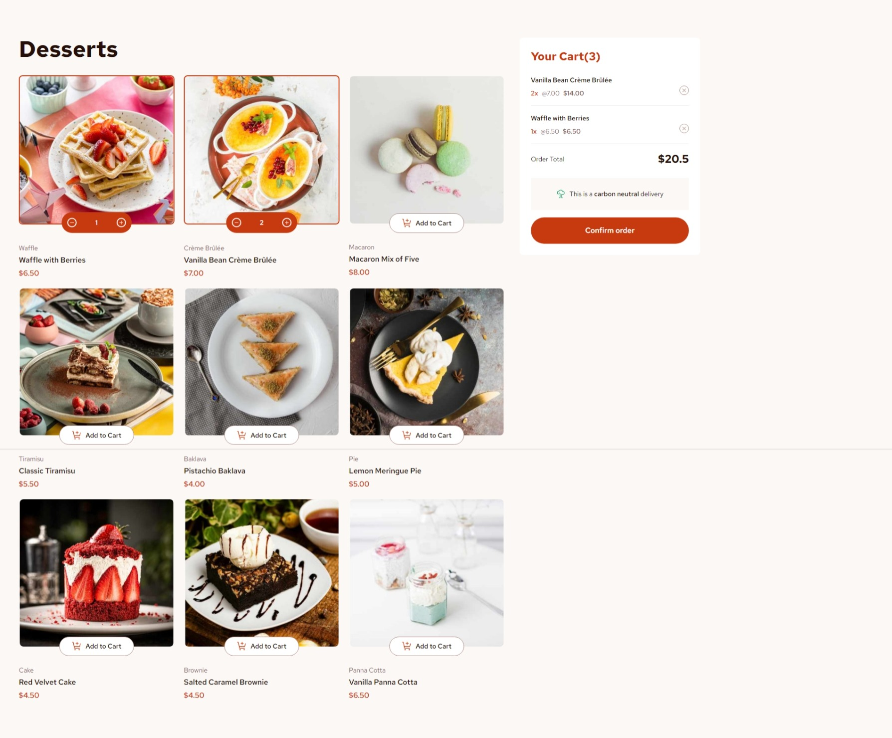

# Frontend Mentor - Product list with cart solution

This is a solution to the [Product list with cart challenge on Frontend Mentor](https://www.frontendmentor.io/challenges/product-list-with-cart-5MmqLVAp_d). Frontend Mentor challenges help you improve your coding skills by building realistic projects.

## Table of contents

- [Overview](#overview)
  - [The challenge](#the-challenge)
  - [Screenshot](#screenshot)
  - [Links](#links)
- [My process](#my-process)
  - [Built with](#built-with)
  - [What I learned](#what-i-learned)
  - [Continued development](#continued-development)
  - [Useful resources](#useful-resources)
- [Author](#author)
- [Acknowledgments](#acknowledgments)

**Note: Delete this note and update the table of contents based on what sections you keep.**

## Overview

### The challenge

Users should be able to:

- Add items to the cart and remove them
- Increase/decrease the number of items in the cart
- See an order confirmation modal when they click "Confirm Order"
- Reset their selections when they click "Start New Order"
- View the optimal layout for the interface depending on their device's screen size
- See hover and focus states for all interactive elements on the page

### Screenshot

### Links

- Solution URL: [Add solution URL here](https://your-solution-url.com)
- Live Site URL: [Add live site URL here](https://your-live-site-url.com)

## My process

I know there are some guidelines on how to start your project and where you should begin working, but I think it ultimately comes down to which area you prefer to start with or what workflow makes you feel comfortable.

I usually begin by gathering all the assets available for the project and selecting the tools I want to use for building it.

Personally, I like to work on HTML and CSS in parallel; I find that Tailwind speeds up this workflow, which is why I usually take that approach. Once I have a design and structure that closely resembles the project, I start implementing simple functionality. For example, in this case, after I had all my products with their 'add to cart' buttons, I wanted to print the JSON representing the product in the console. Even though that small piece of functionality might seem insignificant, it gives me the feeling that the project is really starting, and it reassures me that I'm on the right track from the very beginning.

### Built with

- Semantic HTML5 markup
- Tailwind, Clsx
- Flexbox
- CSS Grid
- Mobile-first workflow
- [React](https://reactjs.org/) - JS library
- Vite

**Note: These are just examples. Delete this note and replace the list above with your own choices**

### What I learned

- How to use React Context, And why in this case was needed
- How to use Component composition, and why in this case was a good use case

### Continued development

- I really like to write clean and readable code, but sometimes I tend not to.

## Author

- Frontend Mentor - [@EDGARTOYIN](https://www.frontendmentor.io/profile/EDGARTOYIN)

## Acknowledgments
